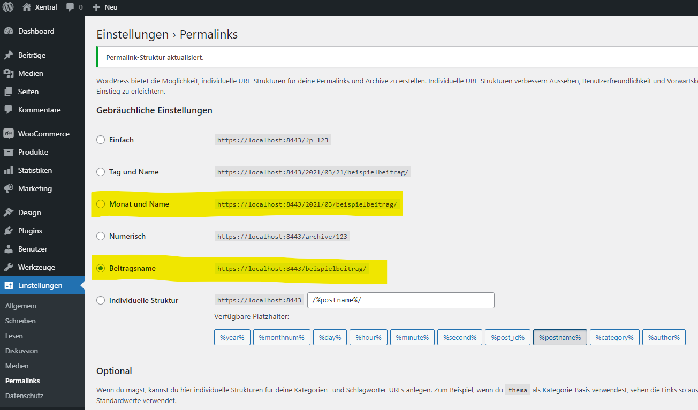
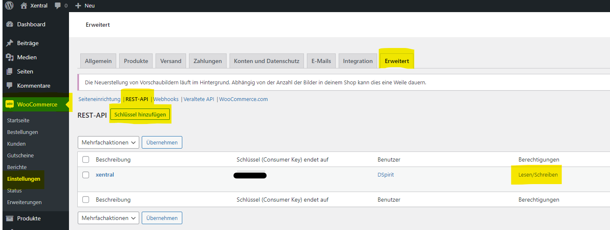
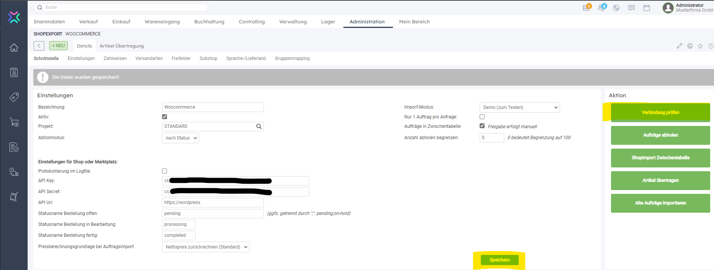

# About
This project should provide a functional playground for connecting a [xentral](https://xentral.com/en/) ERP instance with a [WordPress](https://wordpress.com/) [WooCommerce](https://woocommerce.com/) shop. 

:exclamation: This project is not intended for productive usage, as the databases are just created and managed by further Docker instances and no security aspects have been integrated.
Using this for real scenarios may lead to data loss and severe security breaches! 

# Prerequisites
1. [OpenSSL](https://www.openssl.org/)
1. [Docker](https://www.docker.com/) (Running on Linux Containers)
1. [Docker Compose](https://docs.docker.com/compose/)
1. [PowerShell](https://docs.microsoft.com/en-us/powershell/scripting/install/installing-powershell?view=powershell-7.1)

# Setup
## Prepare SSL Certificates
Run the `setup.ps1` file to create a SSL certificate for the wordpress instance.

## Start Docker Swarm
Run following command to start the containers: `docker-compose up -d`

## Setup Wordpress
1. Install Wordpress with this URL: `https://localhost:8443/`.
1. Install WooCommerce through the Plugin Store.
1. Enable Pretty Permalinks
   
1. Generate Read-Write API Key `WooCommerce>Settings>REST-API` and store it for later use.
   

## Setup Xentral
1. Go to `localhost:8081` and click "Next".
1. In the database setup window, enter following information:
    ```
    Host: xentral-db
    Database: xentral
    User: user
    Password: pass
    ```
1. Add Account Information.
1. Add WooCommerce Plugin.
1. Add `https://wordpress` host and the API Key and Secret from the WooCommerce setup.
   

# Usage
You can now configure your Import / Export tasks and synchronize your WooCommerce shop with your Xentral instance. 

# Credits
Many thanks to [Lobaro](https://github.com/lobaro) for providing the Xentral base docker image. It saved me a lot of trouble and enabled me to create this project.
Of course I'd also like to thank the [Xentral ERP Software GmbH](https://github.com/xentral-erp-software-gmbh) team itself for providing a free version of their incredible ERP project.
I'd also want to thank [WordPress](https://wordpress.com/) for providing an amazing platform and making projects like this possible.

# Sources
[github.com/lobaro/xentral-docker](https://github.com/lobaro/xentral-docker)

[github.com/xentral-erp-software-gmbh](https://github.com/xentral-erp-software-gmbh/downloads)

[hub.docker.com/wordpress](https://hub.docker.com/_/wordpress/)

[hub.docker.com/mysql](https://hub.docker.com/_/mysql/)

[hub.docker.com/httpd](https://hub.docker.com/_/httpd)